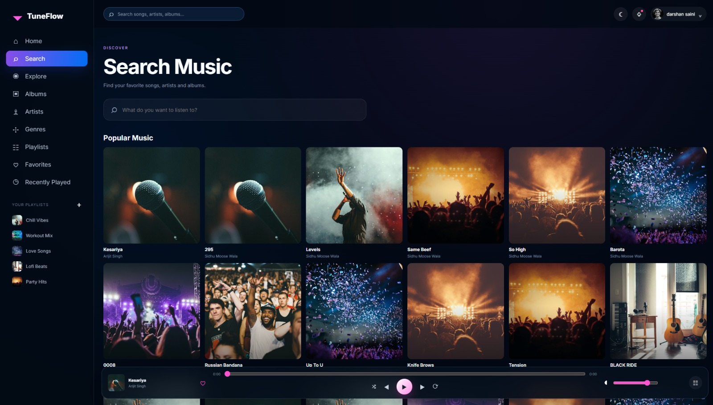
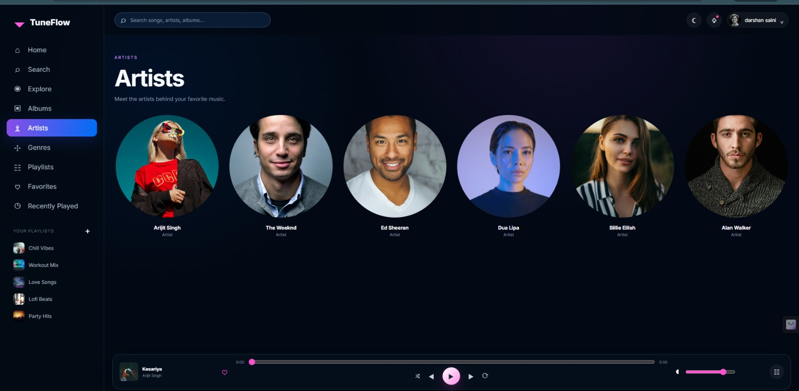
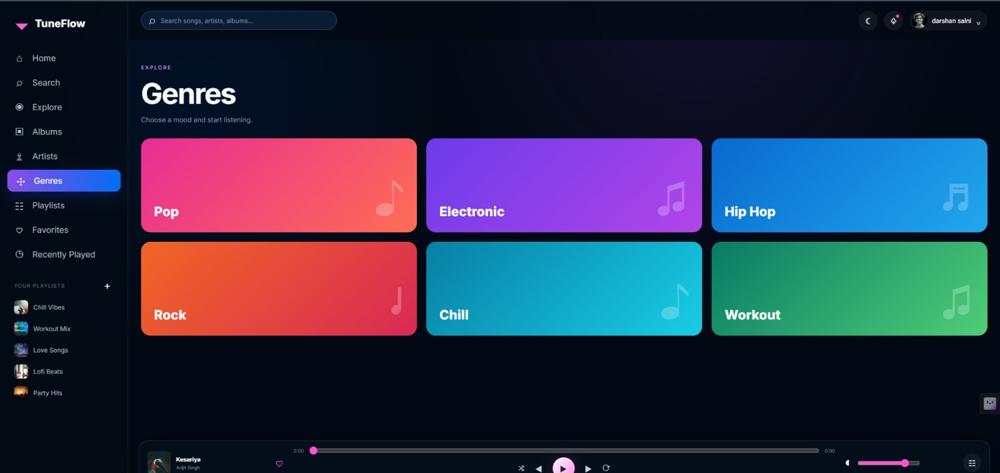

# 🎵 TuneFlow

  <strong>🎧 A Modern • Premium • Responsive Music Player</strong>

  Built with HTML5, CSS3 & Vanilla JavaScript

---

## 🎶 About TuneFlow

TuneFlow is a modern web-based music player featuring a premium dark-neon interface, smooth interactions, responsive design, and an immersive listening experience.

### ✨ Features

* 🎵 Music Library
* ▶️ Audio Controls
* 🔎 Search
* ❤️ Favorites
* 🔀 Shuffle
* 🔁 Repeat
* 🎤 Artists
* 💿 Albums
* 🎼 Genres
* 📱 Fully Responsive UI
* 🌌 Premium Dark Theme

---

## 🖼️ Interface Preview

### 🎧 Hero Interface

  

### 🎵 Music Player Interface

  

### 🎶 Responsive Interface

  

---

## 🛠️ Built With

* **HTML5**
* **CSS3**
* **Vanilla JavaScript**

---

  🎧 <strong>TuneFlow</strong> — Music. Mood. Moment.

  Made with ❤️ by <strong>Darshan Saini</strong>

